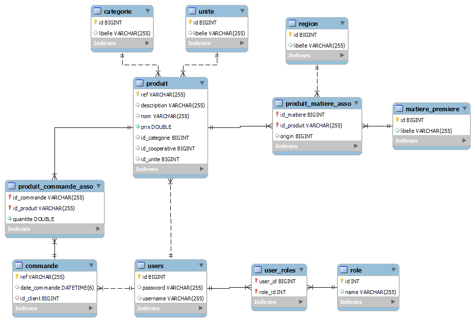

<!-- ABOUT THE PROJECT -->
## Spring Mini Project 2021/2022

[class diagram]

## Built With

This project is built using `Spring Framework`

Here are the spring concepts implemented :

* Spring Data Jpa
* Logging `logback`
* AOP
* Rest API
* Spring Security `JWT`

<!-- Contributers -->
## Contributers

WAHBI Ysssine  - Yawahbi@gmail.com

SAFIR Mohemmed - demosafir@gmail.com

Project Link: [https://github.com/Yawahbi/SpringProjet](https://github.com/Yawahbi/SpringProjet)

(<a href="#top">back to top</a>)

